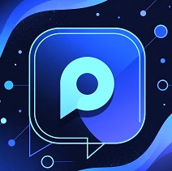
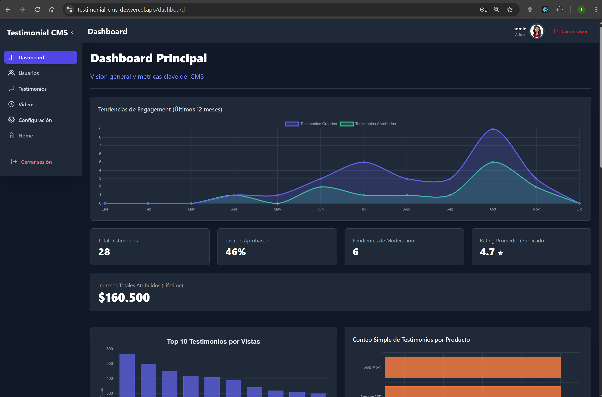
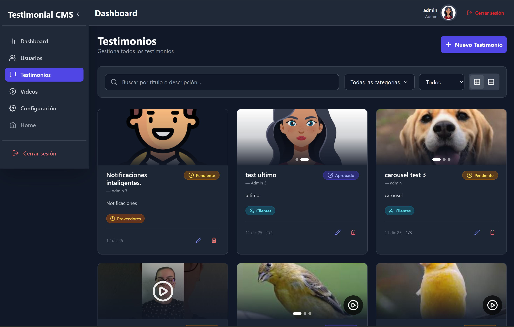
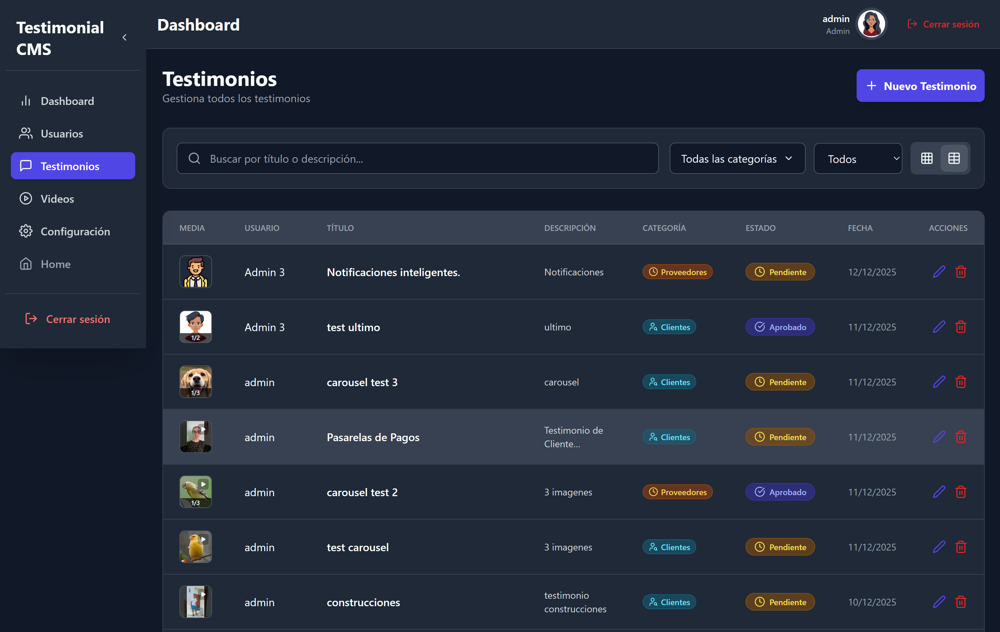

# NCs1125 Equipo 44
# Testimonial CMS – EdTech Impact Platform

  
![Testimonial CMS]

   

    

**Un CMS especializado en gestionar, moderar y publicar testimonios reales con texto, imágenes y videos
 — diseñado para instituciones educativas y empresas EdTech.**

Live Demo: https://testimonial-cms-main.vercel.app  
API Docs: https://n-cs1125e44.vercel.app/api-docs

---

## Equipo de Desarrollo

| Rol               | Nombre       | LinkedIn                                      | GitHub                              | Foto                                      |
|-------------------|--------------|-----------------------------------------------|-------------------------------------|-------------------------------------------|
| Backend Lead      | Mateo Jeremias Pinto  | [LinkedIn](https://linkedin.com/in/mateolopez) | [GitHub](https://github.com/Argiiasd) |  |
| Frontend      | Florencia Lavie | [LinkedIn](https://www.linkedin.com/in/florencia-lavie/)   | [GitHub](https://github.com/FlorLavie)    |  |
| Frontend + UX/UI | Paula Verónica Quiroga  | [LinkedIn](https://linkedin.com/in/paulagomez) | [GitHub](https://github.com/RONIE70) |  |
| Frontend + QA & Testing      | León Asturizaga  | [LinkedIn](https://www.linkedin.com/in/leon-asturizaga-94a80377/) | [GitHub](https://github.com/leonasturizaga)   |  |

---

## Tecnologías

### Backend

### Frontend

### Testing & DevOps

---

## Características Principales

- Creación/edición de testimonios con texto, hasta 3 imágenes y video (YouTube o subida)
- Moderación completa: borrador → pendiente → aprobado/rechazado
- Roles: Admin, Editor, Visitante
- Dashboard con filtros, búsqueda y paginación
- Carrusel automático en tarjetas
- Popup de video con autoplay
- API REST pública documentada
- Integración total con Cloudinary y YouTube

---

## Estructura del Proyecto

## Testimonial-CMS

- ├── backend/          → Node.js + Express + PostgreSQL
- ├── frontend/         → React + Vite + Tailwind
- ├── docs/             → Documentación API (Swagger/OpenAPI)
- └── README.md

---

## Despliegue

Frontend: https://testimonial-cms.vercel.app  
Backend: https://testimonial-cms-api.vercel.app

---

## Licencia

MIT © 2025 - Equipo Testimonial CMS

---
Made with passion by Florencia, Paula, León y Mateo